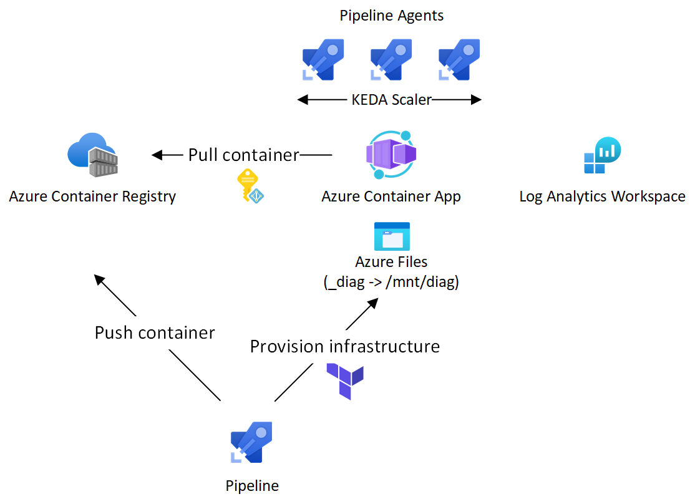

# Azure Pipeline Agent Container App
This repo contains an __experiment__ to run [Azure Pipeline Agents](https://learn.microsoft.com/azure/devops/pipelines/agents/docker?view=azure-devops) in [Azure Container Apps](https://azure.microsoft.com/products/container-apps). For __production__ use, consider [Scale set agents](https://learn.microsoft.com/azure/devops/pipelines/agents/scale-set-agents?view=azure-devops) ([sample repo](https://github.com/geekzter/azure-pipeline-agents)).

Features (see [limitations below](#Limitations)):
- [KEDA Azure Pipelines scaler](https://keda.sh/docs/scalers/azure-pipelines/)
- Diagnostics logs saved on [Azure Files](https://azure.microsoft.com/products/storage/files/)
- Ubuntu based image with core set of tools e.g. Azure CLI, Bash, Helm, Kubectl, Packer, PowerShell, Terraform ([`Dockerfile`](./images/ubuntu/Dockerfile))

 

## Instructions
There are a number of [scripts](./scripts) and [pipelines](./pipelines) you can use to get going. Below, I'll describe a local and pipeline approach, but you can blend these.

### Local setup
- You'll need [Azure CLI](http://aka.ms/azure-cli), Docker, [PowerShell](https://learn.microsoft.com/powershell/scripting/install/installing-powershell) and [Terraform](https://developer.hashicorp.com/terraform/downloads)
- You can use an existing Azure Container Registry (if you already have a shared registry) or let Terraform create one. In case Terraform creates the ACR, there is no opportunity to build and push the container image to the ACR before the Container App will use it.   
Either let Terraform fail -> build & push the image -> retry Terraform apply, or pre-create the ACR. In case you pre-create the ACR, you also need to pre-create a User-assigned Managed Identity with `AcrPull` role on the ACR.
- Build and push the agent container image using [`build_image.ps1`](./scripts/build_image.ps1) script (alternatively, use the [`build-image.yml`](./pipelines/build-image.yml) pipeline in case you don't have Docker locally)
- Create a [Personal Access Token](https://learn.microsoft.com/azure/devops/organizations/accounts/use-personal-access-tokens-to-authenticate) with Agent Pools read & manage scope
- Create a `config.auto.tfvars` file ([example](./terraform/config.auto.tfvars.example)) in the terraform directory, and use it to override the following variables:   
`agent_identity_resource_id`  
`container_registry_id`   
`devops_pat`   
`devops_url` (Organization url `https://dev.azure.com/<org>`)   
- Provision infrastructure by running `terraform apply`

### Pipeline setup
This approach uses the [`deploy-container-agents.yml`](./pipelines/deploy-container-agents.yml) pipeline to build the container image, provision Container App infrastructure and run a test job on a newly created agent.
- You'll need an existing Azure Container Registry (the assumption is that the Service Connection identity does not have the Azure `Owner` role required to configure RBAC and the ACR is a shared component anyway)
- Create an User-assigned Managed Identity with `AcrPush` role on the Azure Container Registry
- Create an [Terraform azurerm backend](https://developer.hashicorp.com/terraform/language/settings/backends/azurerm)
- Create a Docker Registry Service Connection to the ACR
- Create a [Personal Access Token](https://learn.microsoft.com/azure/devops/organizations/accounts/use-personal-access-tokens-to-authenticate) with Agent Pools read & manage scope
- Create a variable group `build-container-agent-image` with the following variable:   
`containerRegistry` (ACR Service Connection)
- Create a variable group `pipeline-container-agents` with the following variables:   
`subscriptionConnection` (Azure Service Connection)  
`TF_STATE_CONTAINER_NAME` ([Terraform azurerm backend](https://developer.hashicorp.com/terraform/language/settings/backends/azurerm) storage container)   
`TF_STATE_RESOURCE_GROUP_NAME` ([Terraform azurerm backend](https://developer.hashicorp.com/terraform/language/settings/backends/azurerm) storage account resource group)  
`TF_STATE_STORAGE_ACCOUNT_NAME` ([Terraform azurerm backend](https://developer.hashicorp.com/terraform/language/settings/backends/azurerm) storage account)  
`TF_VAR_agent_identity_resource_id`  
`TF_VAR_container_registry_id`  
`TF_VAR_devops_pat`
- Make sure you have the [Terraform extension](https://marketplace.visualstudio.com/items?itemName=charleszipp.azure-pipelines-tasks-terraform) installed
- Use the [`deploy-container-agents.yml`](./pipelines/deploy-container-agents.yml) to build the agent container image, provision infrastructure and run a test job on a newly created agent. Override the destroy parameter to prevent the Container App infrastructure from being destroyed at the end of the pipeline run
### Testing
By default, the agents will be created in the `Default` agent pool with system capability `CONTAINER_APP_NAME`. Use the [`image-info.yml`](./pipelines/image-info.yml) pipeline to test the agents. You can override the `numberOfJobs` parameter to test elasticity

## Limitations
This repo is an experiment, you may have various stability issues. Here are some known issues:
- `ScaledJob` is [not supported](https://github.com/microsoft/azure-container-apps/issues/24) in Azure Container Apps. The KEDA Pipelines scaler requires this to indicate a long-running process needs to finish before a pod instance is terminated. This means pipeline jobs can get terminated prematurely.
- Azure Container Apps have a [maximum replica limit of 30](https://learn.microsoft.com/azure/container-apps/scale-app). Hence a Container App pool can at most have 30 agents.
- Azure Container Apps do not yet support [volume mount options](https://github.com/microsoft/azure-container-apps/issues/520). Option [`nobrl`](https://learn.microsoft.com/troubleshoot/azure/azure-kubernetes/mountoptions-settings-azure-files#recommended-settings) is required to guarantee logs are persisted. Hence agents that are configured to terminate after a job run may not have logs fully captured.
- The image is not a general purpose image that works with all of the standard [Azure Pipeline Tasks](https://github.com/microsoft/azure-pipelines-tasks)
- Centralized VNet integration is a challenge. Container App Environments do not yet support [NAT Gateway](https://github.com/microsoft/azure-container-apps/issues/522) and there are known issues with [Azure Firewall](https://github.com/microsoft/azure-container-apps/issues/227). Explicit configuration of a Virtual Networking Appliance requires the upcoming Premium SKU. 